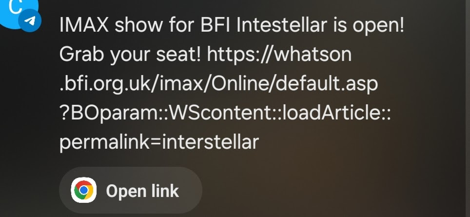

# IMAX Ticket Sniper

I was trying to see **Interstellar** at the BFI IMAX, but showings kept selling out so quickly! To make sure I never missed out on a viewing, I developed a quick **MVP** script that notifies me as soon as new showtimes become available.




The project is a simple web scraper that checks for showtimes on the BFI IMAX website using **Selenium** and then sends me a message via **Telegram** when a showtime is posted. It's an early version and there are lots of improvements that could be made, but it does the job for now!

## How it Works

1. **Web Scraping**: The script uses Selenium to automate browsing and check if new viewings are available for **Interstellar** at the BFI IMAX.
2. **Telegram Notification**: When showtimes are found, the script sends a message to a Telegram bot, notifying me with the showtime details and a link to the booking page so I can grab a ticket before they sell out again.

## Future Improvements

If I continue working on this project, I plan to allow users to:
- Input specific dates they are interested in seeing Interstellar.
- Receive notifications only when showtimes are available for their selected dates.
- Automate the process of booking, or at least sending a reminder with more user-friendly information.

## Setup Instructions

### Requirements

- **Python** (tested with Python 3.8+)
- **Selenium**: Used for web scraping.
- **Requests**: To send messages via Telegram.
- **dotenv**: For managing environment variables like the bot token and chat ID.

Install the required packages:

```bash
pip install selenium webdriver-manager python-dotenv requests
```

### Environment Variables

Create a `.env` file in the project root and add your Telegram bot token and chat ID:

```makefile
BOT_TOKEN=your_bot_token_here
CHAT_ID=your_chat_id_here
```

### Running the Script

To run the script, simply execute:

```bash
python main.py
```

This script will:

- Check the BFI IMAX Interstellar page for available showtimes.
- If showtimes are available, it will send you a Telegram notification.

It's a minimal implementation and won't allow input of custom dates yet. That feature could be added later.

## Future Goals

- **Allow for more dynamic date input**: Enable users to input specific dates, so notifications will only be sent when showtimes for those dates are available.
- **Improve error handling and logging**: Add better error handling to make the script more reliable, as well as logging for easier debugging and monitoring.
- **Provide more user-friendly messages in the Telegram notification**: Make notifications more informative by including the date and time of available showtimes, and perhaps a countdown until the viewing.

